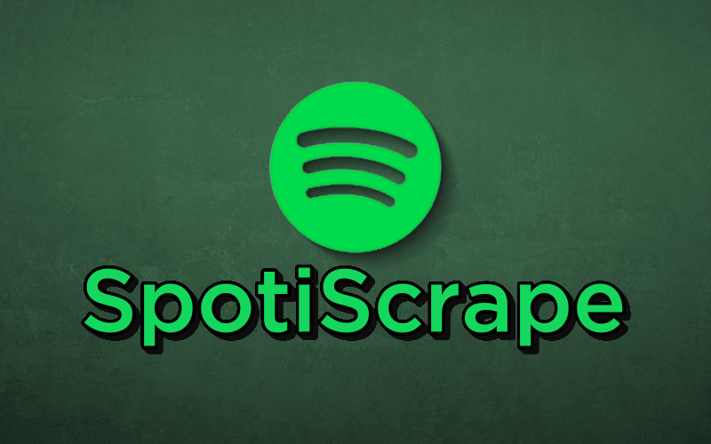

  

# SpotiScrape

SpotiScrape is a Python application designed for fetching and displaying detailed information about Spotify tracks using their URLs. Built with PyQt5 and Spotipy, this tool offers a user-friendly interface for exploring song details such as artist, album, track name, and artwork effortlessly

## Screenshots 

 

## Table of Contents 

- [Installation](#installation) 
- [Usage](#usage) 
- [Features](#features) 
- [Contributing](#contributing) 
- [License](#license) 

## Installation 

Explain how to install your project. 

## Usage 

Provide examples and guidelines on how to use your project. 

## Features 

List and describe the key features of your project. 

## Contributing 

Contributions and feedback are welcome! Feel free to submit issues, feature requests, or pull requests to enhance SpotiScrape.

## License 

This project is licensed under the [License Name] - see the [LICENSE.md](LICENSE.md) file for details. 